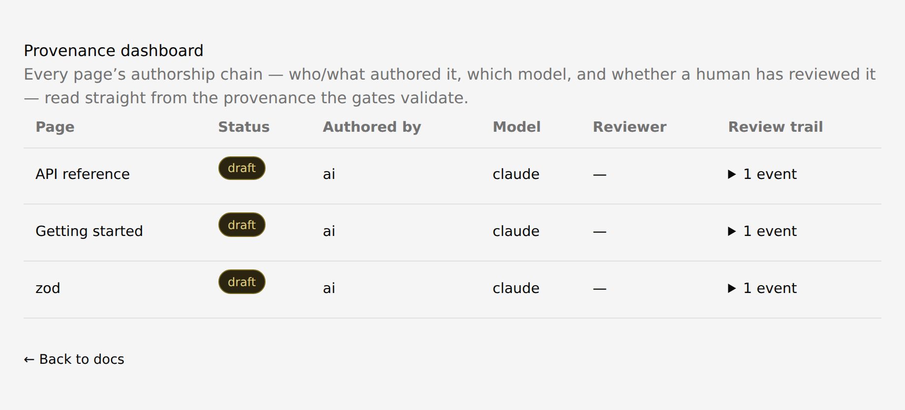

<!-- SPDX-License-Identifier: Apache-2.0 -->

<p align="center">
  <picture>
    <source media="(prefers-color-scheme: dark)" srcset="assets/nema-wordmark-dark.svg?v=2">
    
  </picture>
</p>

<p align="center">
  <strong>The open, AI-native docs platform for the agentic era</strong><br>
  <sub>Your agents write the docs · a human approves every page · provenance is git-diffable data</sub>
</p>

<p align="center">
  <a href="#quickstart">Quickstart</a> &nbsp;·&nbsp;
  <a href="#use-it-with-your-agent">Use it with your agent</a> &nbsp;·&nbsp;
  <a href="#learn-more">Learn more</a> &nbsp;·&nbsp;
  <a href="CLAUDE.md">Agent contract</a>
</p>

<p align="center">
  <a href="https://github.com/albertogrande/nema/actions/workflows/ci.yml"></a>
  <a href="https://github.com/albertogrande/nema/actions/workflows/codeql.yml"></a>
  <a href="https://securityscorecards.dev/viewer/?uri=github.com/albertogrande/nema"></a>
</p>

<p align="center">
  <a href="LICENSE"></a>
  
  
  
</p>

<hr>

<p align="center">
  
  <br>
  <sub><b>The <code>/trust</code> dashboard, live.</b> Three pages an agent drafted from the
  <a href="https://github.com/colinhacks/zod">zod</a> source — each <code>draft</code>, AI-authored,
  and <b>pending a human review</b>. Provenance read straight from the data the gates validate.</sub>
</p>

**Nema is an open, self-hostable docs platform for teams who want their coding agents to write the
docs — safely.** Point your own agents (Claude Code, Cursor, your own pipeline) at your repo and they
draft, link, and maintain pages with full context of the existing corpus. Every page is gated by a
human PR approval and carries a git-diffable record of who wrote it, from which sources, and who
signed off — all rendered through [Fumadocs](https://fumadocs.dev), on infrastructure you control.

**What you get:**

- 🤖 **Agents author, humans approve** — every page is agent-written, and nothing reaches `reviewed`
  without a human PR approval. That gate is the one invariant.
- 🔍 **Provenance as git-diffable data** — who wrote it, which model, which sources, which reviewer —
  recorded as structured, queryable data, not free-text footnotes.
- 🧵 **Multi-agent authoring without clobbering** — point a fleet of agents at one corpus; slot leasing
  and a merge-time coherence gate keep them from overwriting each other's pages.
- ✅ **Gate-checked before the PR** — `nema check` catches broken links, orphans, stale frontmatter, and
  self-promotion, with a fix hint per failure — the same report for a human and for an agent in a loop.
- 🩺 **Docs that stay honest about the code** — bind a page to the source it documents, and `nema drift`
  flags it the moment the code's public surface moves past its approved baseline.
- 🔓 **Renderer-agnostic and self-hostable** — renders through [Fumadocs](https://fumadocs.dev); your
  agents, your corpus, your infra. Apache-2.0, no SaaS lock-in.

> **Alpha — honest status.** Today an agent drafts a page that lands in your nav, linked and cited,
> self-checks against the gates, and opens a PR you approve — rendered live. Multi-agent authoring
> (slot leasing + a merge-time coherence gate) ships and runs in CI. A hosted control plane is still
> ahead, and APIs may change before 1.0.

## Quickstart

Stand up a brand-new, agent-native docs site — from nothing to a rendered, provenance-badged page in
about five minutes. **You need Node 22+.** No git, no account, no agent required to get there.

### 1. Scaffold and run

```bash
npx create-nema my-docs --app
cd my-docs
npm install          # npm may print audit warnings — fine for local dev
npm run dev          # → http://localhost:3000
```

Open the URL: your docs render with a **"pending review"** provenance badge and a **`/trust`**
dashboard. That's the idea made concrete — every page shows whether a human has signed off. Confirm
the corpus is valid out of the box:

```bash
nema check           # → all gates passed
```

Everything so far works with **no git, no account, no agent**.

### 2. Add a page — your agent does the writing

Authoring is your agent's job, not yours at a terminal. Point your coding agent (Claude Code shown;
the MCP server is agent-agnostic) at the repo:

```bash
claude mcp add nema -- npx -y @getnema/cli mcp .
```

Then ask it, in plain language:

> Draft a "Getting Started" how-to page, link it from the docs index, and run `nema check`.

Your agent writes the page with a full **provenance block** (`authored_by: ai`, the model, a `draft`
transition), links it into the nav, and self-checks against the gates — fixing whatever they flag.
Reload `localhost:3000` and the page is there, badged *pending review*.

### 3. Ship it for approval

When you're ready to promote a draft to **reviewed**:

```bash
nema open-pr         # the first step that needs git + a GitHub remote + the `gh` CLI
```

A human approves the PR on GitHub — the **only** path to `reviewed`. An Action runs `nema approve`,
flips `draft → reviewed`, stamps freshness, and merges. That approval gate is the one invariant.

## Use it with your agent

Nema is meant to be run *by* your coding agent — the MCP interface is agent-agnostic (Claude Code,
Cursor, your own pipeline). Register it against any Nema repo:

```bash
claude mcp add nema -- npx -y @getnema/cli mcp /path/to/your-docs
```

Your agent can now search, read, and **draft** pages with full corpus context — but it **cannot**
promote a page to `reviewed`. Only your PR approval can. The rules every agent must follow live in
[CLAUDE.md](CLAUDE.md) (applied via [AGENTS.md](AGENTS.md)).

## Learn more

- **Already have docs?** [QUICKSTART.md](QUICKSTART.md) brings an existing repo under Nema with
  `nema migrate`.
- **Runnable walkthroughs** — [`examples/concurrent`](examples/concurrent) (multi-agent authoring),
  [`examples/drift`](examples/drift) (docs that track code), and [`examples/minimal`](examples/minimal).
- **The agent contract** — [CLAUDE.md](CLAUDE.md) spells out the producer loop, the provenance rules,
  and every gate `nema check` enforces.

## Status

**v0.3 alpha.** The producer loop runs end to end and renders; multi-agent authoring (slot leasing +
merge-time coherence) ships and is exercised in CI. The engine is green (tests, lint, typecheck,
build). Expect breaking changes before 1.0.

## Contributing

Nema is a pnpm + Turborepo monorepo. Contributions are accepted under the
[Developer Certificate of Origin](CONTRIBUTING.md) — sign your commits with `git commit -s`. Start with
[CONTRIBUTING.md](CONTRIBUTING.md) for the package layout and dev setup; see [GOVERNANCE.md](GOVERNANCE.md)
for how decisions get made.

## License

[Apache-2.0](LICENSE). The whole engine is open source. The reserved [`ee/`](ee) directory is out of
scope for the core license and reserved for a future source-available commercial tier.
