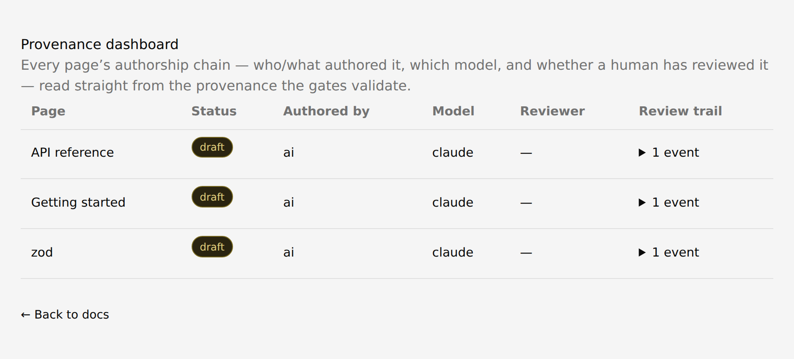

<!-- SPDX-License-Identifier: Apache-2.0 -->

<p align="center">
  <picture>
    <source media="(prefers-color-scheme: dark)" srcset="assets/nema-wordmark-dark.svg?v=2">
    
  </picture>
</p>

<p align="center">
  <strong>Your coding agents write the docs. You approve the PR.</strong><br>
  <sub>The open-source, self-hostable docs platform for teams whose coding agents outrun their docs — every draft gate-checked, every page's provenance a git-diffable record.</sub>
</p>

<p align="center">
  <a href="#quickstart">Quickstart</a> &nbsp;·&nbsp;
  <a href="#use-it-with-your-agent">Use it with your agent</a> &nbsp;·&nbsp;
  <a href="#learn-more">Learn more</a> &nbsp;·&nbsp;
  <a href="CLAUDE.md">Agent contract</a>
</p>

<p align="center">
  <a href="https://github.com/albertogrande/nema/actions/workflows/ci.yml"></a>
  <a href="https://github.com/albertogrande/nema/actions/workflows/codeql.yml"></a>
  <a href="https://securityscorecards.dev/viewer/?uri=github.com/albertogrande/nema"></a>
  <a href="LICENSE"></a>
  <a href=".nvmrc"></a>
</p>

<hr>

<p align="center">
  
  <br>
  <sub><b>The <code>/trust</code> dashboard, live.</b> Three pages an agent drafted from the
  <a href="https://github.com/colinhacks/zod">zod</a> source — each <code>draft</code>, AI-authored,
  and <b>pending a human review</b>. Provenance read straight from the data the gates validate.</sub>
</p>

**Why Nema exists.** Coding agents ship code faster than anyone documents it. Let them write the
docs and you either review every word yourself or publish text nobody can vouch for.

Docs platforms assume a human author. Linters check style, not trust.

**Nema restructures the job.** Point your own agents (Claude Code, Cursor, your own pipeline) at your
repo and they draft, link, and maintain pages with full context of the existing corpus. Gates catch
what's broken before a PR opens, and every page carries a git-diffable record of who wrote it, from
which sources, and who signed off.

You do the one thing only a human can — approve — and nothing reaches `reviewed` without it. It all
renders through [Fumadocs](https://fumadocs.dev), on infrastructure you control.

**What you get:**

- 🤖 **Agents author, humans approve** — every page is agent-written, and nothing reaches `reviewed` without a human PR approval.
- ✅ **Gate-checked before the PR** — `nema check` flags broken links, orphans, stale frontmatter, and self-promotion, each with a fix hint.
- 🔍 **Provenance as git-diffable data** — who wrote it, which model, which sources, which reviewer, recorded as structured data.
- 🩺 **Docs born from the code** — `nema generate <repo>` seeds `draft` pages from a repo's public API (never invented prose), and `nema drift` flags them when the code moves past its baseline.
- 🧵 **Multi-agent authoring without clobbering** — slot leasing and a merge-time coherence gate keep a fleet of agents from overwriting each other's pages.

> **Alpha — honest status.** Today an agent drafts a page that lands in your nav, linked and cited,
> self-checks against the gates, and opens a PR you approve — rendered live. Multi-agent authoring
> (slot leasing + a merge-time coherence gate) ships and runs in CI. A hosted control plane is still
> ahead, and APIs may change before 1.0.

## Quickstart

Stand up a brand-new, agent-native docs site — from nothing to a rendered, provenance-badged page in
about five minutes. **You need Node 22+.** No git, no account, no agent required to get there.

### 1. Scaffold and run

```bash
npx create-nema my-docs --app
cd my-docs
npm install          # npm may print audit warnings — fine for local dev
npm run dev          # → http://localhost:3000
```

Open the URL: your docs render with a **"pending review"** provenance badge and a **`/trust`**
dashboard. That's the idea made concrete — every page shows whether a human has signed off. Confirm
the corpus is valid out of the box:

```bash
nema check           # → all gates passed
```

Everything so far works with **no git, no account, no agent**.

### 2. Add a page — your agent does the writing

Authoring is your agent's job, not yours at a terminal. Point your coding agent (Claude Code shown;
the MCP server is agent-agnostic) at the repo:

```bash
claude mcp add nema -- npx -y @getnema/cli mcp .
```

Then ask it, in plain language:

> Draft a "Getting Started" how-to page, link it from the docs index, and run `nema check`.

Your agent writes the page with a full **provenance block** (`authored_by: ai`, the model, a `draft`
transition), links it into the nav, and self-checks against the gates — fixing whatever they flag.
Reload `localhost:3000` and the page is there, badged *pending review*.

### 3. Ship it for approval

When you're ready to promote a draft to **reviewed**:

```bash
nema open-pr         # the first step that needs git + a GitHub remote + the `gh` CLI
```

A human approves the PR on GitHub — the **only** path to `reviewed`. An Action runs `nema approve`,
flips `draft → reviewed`, stamps freshness, and merges. That approval gate is the one invariant.

## Use it with your agent

Nema is meant to be run *by* your coding agent — the MCP interface is agent-agnostic (Claude Code,
Cursor, your own pipeline). Register it against any Nema repo:

```bash
claude mcp add nema -- npx -y @getnema/cli mcp /path/to/your-docs
```

Your agent can now search, read, and **draft** pages with full corpus context — but it **cannot**
promote a page to `reviewed`. Only your PR approval can. The rules every agent must follow live in
[CLAUDE.md](CLAUDE.md) (applied via [AGENTS.md](AGENTS.md)).

**Solo maintainer?** GitHub does not let a PR's author approve it — and when your agent proposes
with *your* `gh` login, you are the author. Two ways through, both human-gated:

- **Zero setup (the default):** comment **`/nema approve`** on the draft PR. A permission-checked
  workflow promotes the PR's draft pages (recorded honestly in provenance as
  `method: maintainer-command`) and merges. Scaffolded repos ship this out of the box.
- **GitHub-native reviews:** set **`NEMA_PROPOSE_TOKEN`** to a machine-user PAT or GitHub-App
  installation token — draft PRs are then authored by that bot identity, so the normal
  review-approve flow works. `NEMA_BOT_NAME` / `NEMA_BOT_EMAIL` override the bot's committer
  identity.

On a **protected default branch**, also set **`NEMA_PROMOTE_TOKEN`** (a PAT of your own account
works) and enable the repo's **"Allow auto-merge"** setting: the token lets the promotion commit
re-trigger CI, and auto-merge completes the merge once those checks pass. Without them the
approval still promotes, but the PR waits for a manual merge.

`nema doctor` tells you which mode your repo is in, warns when the propose identity and the
approver would collide, and checks the auto-merge setting.

## Learn more

- **Already have docs?** [QUICKSTART.md](QUICKSTART.md) brings an existing repo under Nema with
  `nema migrate`.
- **Runnable walkthroughs** — [`examples/concurrent`](examples/concurrent) (multi-agent authoring),
  [`examples/drift`](examples/drift) (docs that track code), and [`examples/minimal`](examples/minimal).
- **The agent contract** — [CLAUDE.md](CLAUDE.md) spells out the producer loop, the provenance rules,
  and every gate `nema check` enforces.

## Status

**v0.4 alpha.** The producer loop runs end to end and renders; multi-agent authoring (slot leasing +
merge-time coherence) and docs-from-code (`nema generate`) ship and are exercised in CI. The engine
is green (tests, lint, typecheck, build). Expect breaking changes before 1.0.

## Contributing

Nema is a pnpm + Turborepo monorepo. Contributions are accepted under the
[Developer Certificate of Origin](CONTRIBUTING.md) — sign your commits with `git commit -s`. Start with
[CONTRIBUTING.md](CONTRIBUTING.md) for the package layout and dev setup; see [GOVERNANCE.md](GOVERNANCE.md)
for how decisions get made.

## License

[Apache-2.0](LICENSE). The whole engine is open source. The reserved [`ee/`](ee) directory is out of
scope for the core license and reserved for a future source-available commercial tier.
